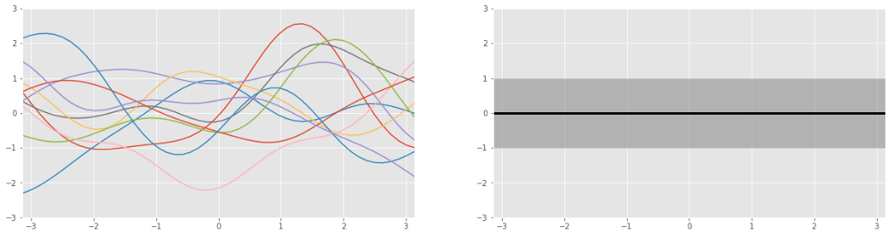
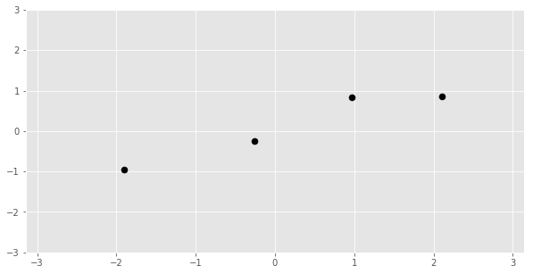
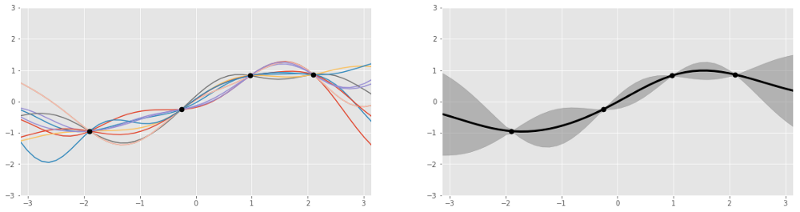

# Gaussian Process

## An intuitive guide

**A Guassian Process is a probability distribution over possible functions**

Since Gaussian processes let us describe probability distributions over functions we can use Bayes’ rule to update our distribution of functions by observing training data. We’ll update our belief about an unknown function **given some samples from that function**.

    Our prior belief about the the unknown function is visualized below. On the right is the mean and standard deviation of our Gaussian process — we don’t have any knowledge about the function so the best guess for our mean is in the middle of the real numbers i.e. 0.

    On the left each line is a sample from the distribution of functions and our lack of knowledge is reflected in the wide range of possible functions and diverse function shapes on display. Sampling from a Gaussian process is like rolling a dice but each time you get a different function, and there are an infinite number of possible functions that could result.

    Instead of observing some photos of Obama we will instead observe some outputs of the unknown function at various points. For Gaussian processes our evidence is the training data.

    Now that we’ve seen some evidence let’s use Bayes’ rule to update our belief about the function to get the posterior Gaussian process AKA our updated belief about the function we’re trying to fit.

    Similarly to the narrowed distribution of possible heights of Obama what you can see is a narrower distribution of functions. The updated Gaussian process is constrained to the possible functions that fit our training data —the mean of our function intercepts all training points and so does every sampled function. We can also see that the standard deviation is higher away from our training data which reflects our lack of knowledge about these areas.